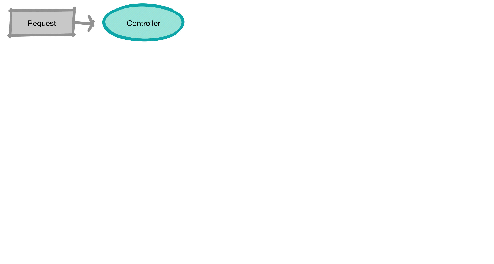
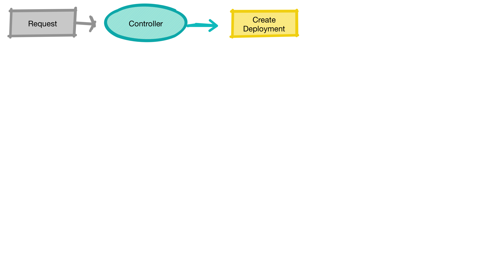
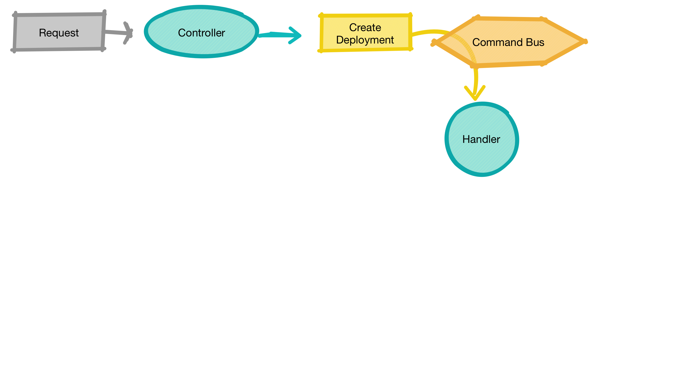
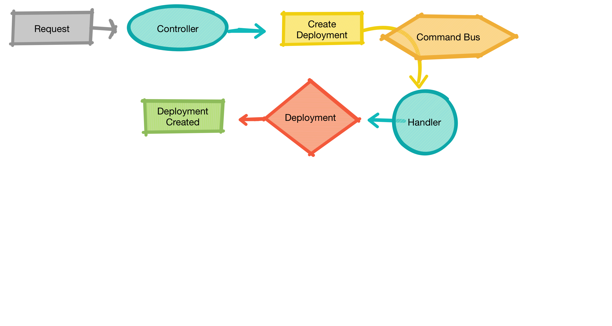
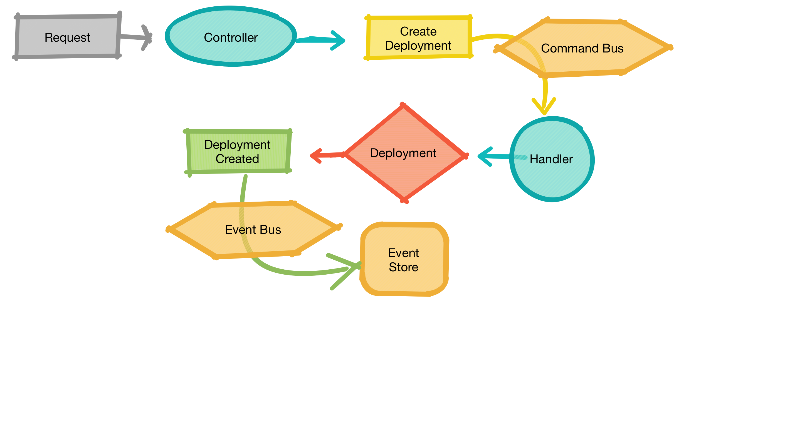
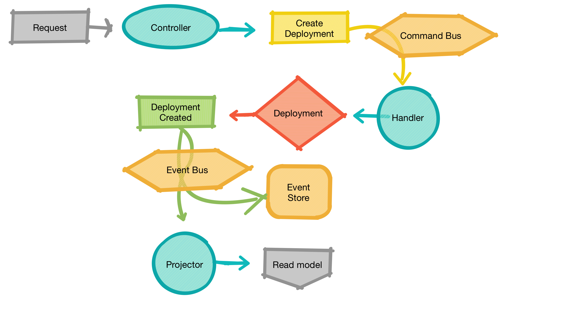
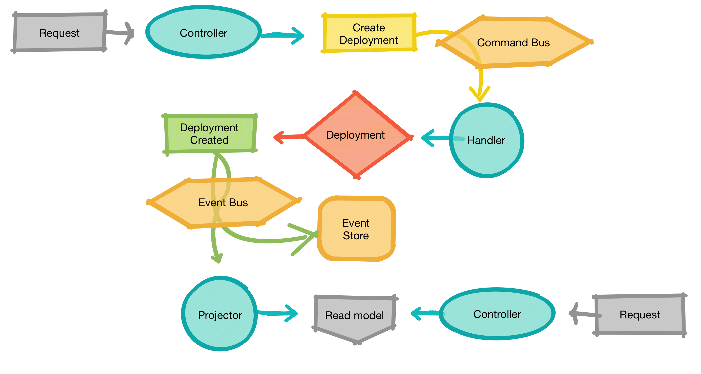

# CQRS/ES

Was ist das? Warum brauch ich das?

<small>Einhorn Lunch Jan Galinski 27.02.19</small>

--

## Hypothese (1)

> Code is easy
 
> State is <red>hard</red>

--

## Hypothese (2)

> CQRS mit Eventsourcing ist ein fantastisches Architekturmuster 
> zum Bau nachrichtenbasierter, lose gekoppelter (Microservice) Systeme

---

# CQRS/ES ?

* Trennung von lesenden und schreibenden Zugriffen
* Events als einzige Persistenz des Systems

--

## Command
## Query
Responsibility Segregation
 
## Event
Sourcing

---

# Command

--

### Commands

* drücken einen `Intent` aus
* sind in die Zukunft gerichtet
* Verändern das System (`write`)
* werden als Imperativ formuliert (`CreateCustomer`)

--

### Command handler

* verarbeiten `Commands`
* können die Bearbeitung abweisen (wenn Zustand es nicht erlaubt) 
* liefern kein Ergebnis

---

# Query

--

### Queries

* beschreiben lesende Zugriffe auf das System (`find`, `get`)
* verändern niemals den Zustand des Systems

--

### Query handler

* liefern Antworten auf typisierte Fragen
* erlauben Subskription auf Änderungen der Antwort

---

# Event

--
 
### (Domain) Events

* unveränderliche Fakten, liegen in der Vergangenheit
* Beschreiben Ereignisse, die in der Domaine passiert sind
* werden als Partizip formuliert (`CustomerCreated`)
* sind die "single point of truth" Persistenz des Systems

--

### Event handler

* Erzeugen materialisierte Sichten (Projektion) aus dem Strom der Ereignisse
* können Commands auslösen

---

# CQRS/ES !

--

---

# Event Sourcing

> Event Sourcing ensures that all changes to application state are stored as a sequence of events.
>> Martin Fowler

--

### Append-only Store

* optmiert für schnelles Schreiben
* lock-free
* einfach verteilbar

--

### Event Sourcing

* Verwenden historischer Events für neue Anforderungen
* Debug/Fehlerananylse durch Replay von/bis
* Audit Log for free

---

# "Demo"

* create a deployment

--

--

--

--

--

--

--

---

## Links

* [Heise - CQRS neues Architekturprinzip zur Trennung von Befehlen und Abfragen](https://www.heise.de/developer/artikel/CQRS-neues-Architekturprinzip-zur-Trennung-von-Befehlen-und-Abfragen-1797489.html)

---

# `exit(0)`

--

---
