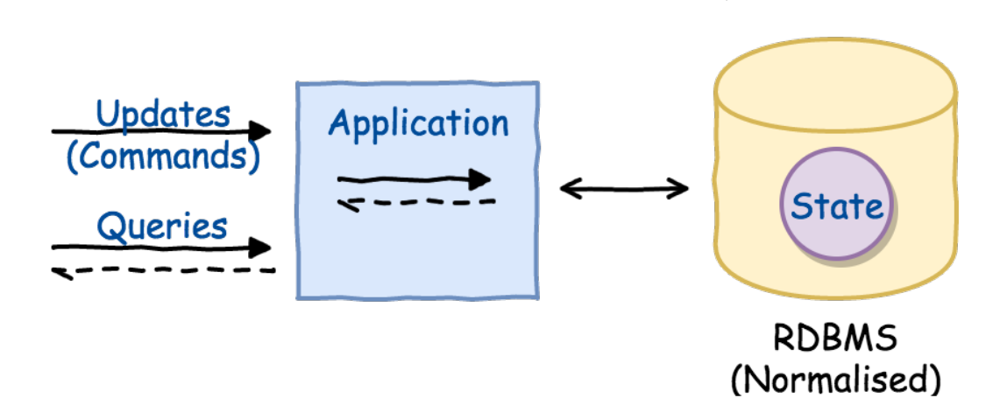
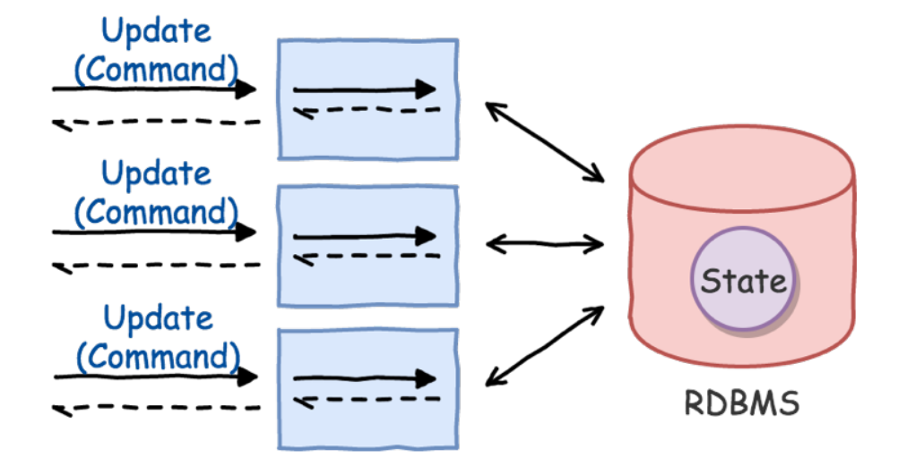
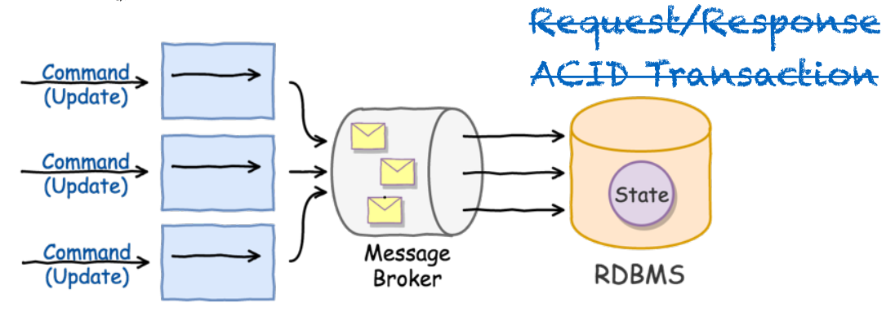
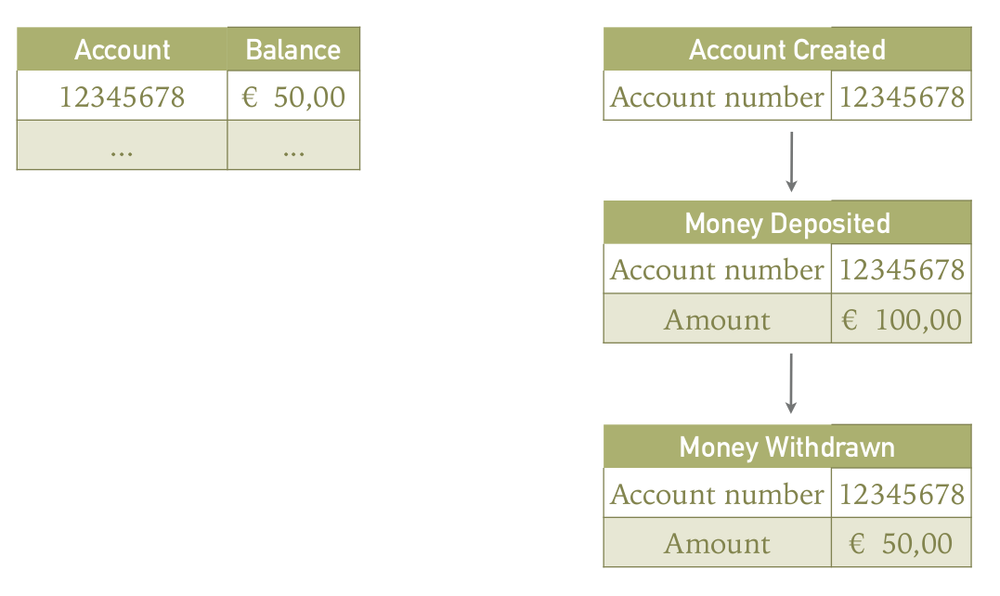
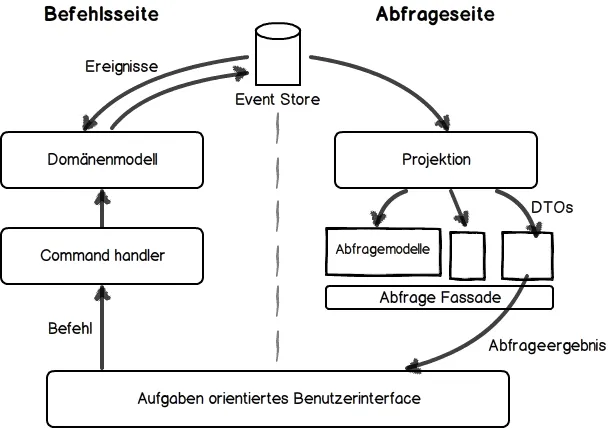

# CQRS/ES

Was ist das? Warum brauch ich das?

<small>Einhorn Lunch Jan Galinski 27.02.19</small>

--v

## Hypothese

> CQRS mit Eventsourcing ist ein fantastisches Architekturmuster 
> zum Bau nachrichtenbasierter, lose gekoppelter (Microservice) Systeme

--->

# Systems have State

--v

## State is represented by Domain Objects

- aka. Entities 
- aka. Aggregate (DDD)

--v

### State can be modified
<h1 class="fragment">&rarr; COMMAND</h1>

--v

### State can be retrieved

<h1 class="fragment">&rarr; QUERY</h1>

--v

## Code is easy
 
## State is hard

--->

# CRUD

Create - Update - Delete

--v

### Request/Response

synchronous

--v

### Scaling up

synchronous

--v

### Message Driven

asynchronous

--v

# Eventual consistent

* query will "soon" retrieve correct state
* ACID &rarr; BASE
* we no longer benefit from having the same read/write model

--->

# CQRS

--v

## Command
## Query
### Responsibility
### Segregation

--v
<!-- .slide: data-background="./img/data-flow.svg" height="100%" -->

.
--v

# Command

* expresses and Intent that something should happen in the future
* has an imperative name (CreateOrder)
* can fail
* modifies the state
* triggers events

--v

# Event

* expresses somthing that happened in the past
* has a participe name (OrderCreated)
* is an immutable fact
* can not fail

--->

# Event Sourcing

> Event Sourcing ensures that all changes to application state are stored as a sequence of events.
>> Martin Fowler

--v

### Event Store

* append only, lock-free
* optimized for quick write
* easy to distribute
* single point of truth
* can be used to (re-)create State

--v

### Event Sourcing

--v

## Benefits

* multiple Read models (Projection) with dedicated purpose
* audit log for free
* analyse/debug State by replaying selected events
* correct errors with compensation events

--->

### System Overview

--->

# "Demo"

* create a deployment

--v

--v

--v

--v

--v

--v

--v

--->

# `exit(0)`

